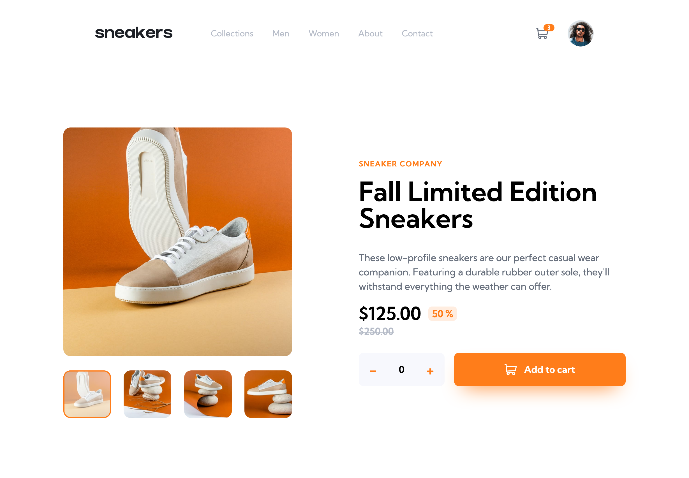

# Frontend Mentor - E-commerce product page solution


This is a solution to the [E-commerce product page challenge on Frontend Mentor]()
## Table of contents

- [Overview](#overview)
  - [The challenge](#the-challenge)
  - [Screenshot](#screenshot)
  - [Links](#links)
- [My process](#my-process)
  - [Built with](#built-with)
  - [What I learned](#what-i-learned)
  - [Continued development](#continued-development)
  - [Useful resources](#useful-resources)


## Overview

### The challenge

Users should be able to:

- ✅ View the optimal layout for the site depending on their device's screen size 
- ✅ See hover states for all interactive elements on the page
- ✅ Open a lightbox gallery by clicking on the large product image
- ✅ Switch the large product image by clicking on the small thumbnail images
- ✅ Add items to the cart
- ✅ View the cart and remove items from it

### Screenshot


### Link

- [Heroku hosted website](http://aniscoquelet-mentorchallenge.herokuapp.com)

## My process

### Built with

- [React](https://reactjs.org/) - JS library
- [Tailwind](https://tailwindcss.com/) - CSS Framework
- [Heroku](https://heroku.com/) Hosting Platform
- Semantic HTML5 markup
- Flexbox
- Mobile-first workflow


### What I learned

During this challenge I learned how to build an app using React. It made me confident in the use of components, props and states.

I also learned how to quickly apply CSS classes to HTML tags using Tailwind, along with some CSS tricks and basic animations.

Using React and Tailwind along with JavaScript Template Literals allowed me to easily apply classes depending on the state of my components :


```html
<div
    id="cart"
    className={`${cart.isActive ? "visible opacity-100" : "invisible -translate-y-3 opacity-0} ...`}>
    ...
</div>
```

Here, the code reads the *isActive* property of the *cart* state. If its value is true, it will show the cart by applying **visible** and **opacity-100** classes. Else, it will hide it by applying **invisible** and **opacity-0** classes. The **-translate-y-3** class is applyied to animate the cart whenever it's shown or hidden. I used this method in several areas of the code and it saved me a great amount of to-lime-50

It was also my first time developing a fully responsive website. It proved itself to be a little more challenging than thought but setting my own breakpoints I finally managed to make the layout responsive-ish (could've been better but i'm quite satisfied with the result already !)


### Continued development

I sort of started coding this website without thinking about how I'd get things done. In the future I'd like to improve on several points : 
- **Decomposing the sketch into components before starting to write code**
- **Adopting a git workflow and using one branch per feature**
- **Sticking to a mobile-first approach**

Overall, I think I'd benefit from being more organized.

### Useful resources

- [fullstackopen](https://fullstackopen.com/en/) - This open source course from the University of Helsinki helped me understand the basics of React. It covers multiple themes in modern Web Development !
- [stack overflow](https://stackoverflow.com) - Do I really need to explain ?
